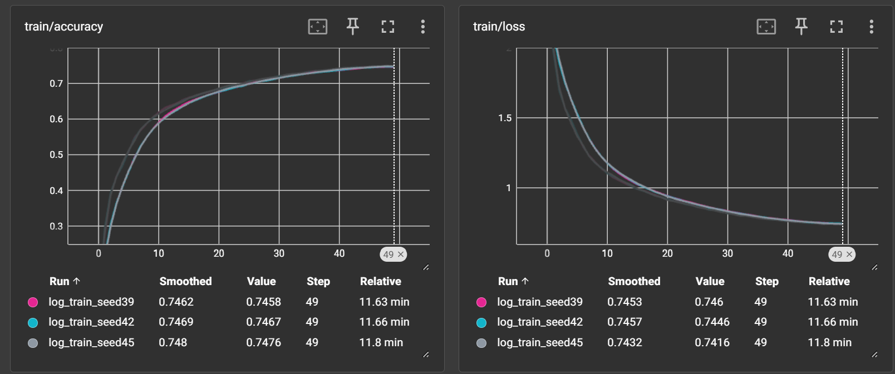

# 学习记录和存档
| 组件 | 版本 |
|------|------|
| Python | 3.10.1 |
| PyTorch | 2.0.0+cu118 |
| torchvision | 0.15.0+cu118 |
| tensorboard | 2.20.0 |
| CUDA | 11.8 |
| GPU 可用 |True |


Project2一键运行代码： 
```bash
python validate.py
```
期望运行结果（统一为50epoch）：

          avg_loss = 0.7418
          top1 = 75.46%
          seed = 39
          
          avg_loss = 0.7329
          top1 = 75.53%
          seed = 42
          
          avg_loss = 0.7365
          top1 = 75.47%
          seed = 45


##  Result Card
BaseLine：
```
[Epoch 50/50] Train Loss: 0.3283, Train Acc: 0.8855, Test Loss: 1.3774, Test Acc: 0.6627
```
标准增强的 Top-1：
```
Top-1 Accuracy (µ ± σ)=0.7549±0.00031
```

